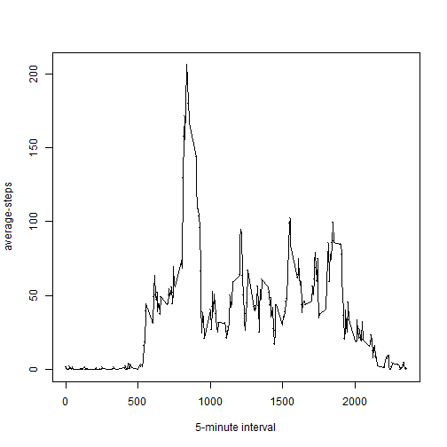

# Peer Assesment 1
 
 ================

This assignment makes use of data from a personal activity monitoring device. This device collects data at 5 minute intervals through out the day. The data consists of two months of data from an anonymous individual collected during the months of October and November, 2012 and include the number of steps taken in 5 minute intervals each day.

## Data

The data for this assignment can be downloaded from the course web site:

**Dataset:** [Activity monitoring data](https://d396qusza40orc.cloudfront.net/repdata%2Fdata%2Factivity.zip) [52K]

The variables included in this dataset are:

 - **steps:** Number of steps taking in a 5-minute interval (missing values are coded as NA)


- **date:** The date on which the measurement was taken in YYYY-MM-DD format


- **interval:** Identifier for the 5-minute interval in which measurement was taken


The dataset is stored in a comma-separated-value (CSV) file and there are a total of 17,568 observations in this dataset.

The data is loaded as follows:


```r
dat_actvt <- read.csv("activity.csv") 
```

The following four questions are addressed in this asignment.

## 1. What is mean total number of steps taken per day? 

To answer this question I am just taking the complete cases. Out of 61 cases(days) there are 53 complete cases (days). From this complete cases data, total number of steps taken each day is calculated. The mean and median of the total number of steps taken each day is also calculated. A histogram of total steps(y-axis) vs days (x-axis) is drawn.


```r
library(plyr)
dat_complt <- dat_actvt[complete.cases(dat_actvt), ]
total_day <- ddply(dat_complt, "date", function(x) sum(x[, 1]))
hist(total_day$V1)
```

 

```r
summary(total_day$V1)
```

```
##    Min. 1st Qu.  Median    Mean 3rd Qu.    Max. 
##      41    8841   10760   10770   13290   21190
```
## What is the average daily activity pattern?
To answer this question the data is grouped as per 5 minutes intervals for all days together and a graph is drawn as average steps vs 5 minutes interval. The graph shows average number of steps is maximum around 9:00am interval

```r
library(plyr)
dat_actvt <- read.csv("activity.csv")
dat_complt <- dat_actvt[complete.cases(dat_actvt), ]
daily_pattern <- ddply(dat_complt, "interval", function(x) mean(x[, 1]))
colnames(daily_pattern) <- c("interval", "avrgsteps")
plot(daily_pattern$interval, daily_pattern$avrgsteps,pch=".",
     type="o", xlab="5-minute interval", ylab="average-steps")
```

 

### calculating total number of missing rows:

```{r}(dat1, "interval", function(df) sapply(df, function(x){
  if(is.numeric(x)){
    impute.mean(x)
  } else {
    x
  }
}  

))
library(plyr)
dat_actvt <- read.csv("activity.csv")
dat_na <- dat_actvt[dat_actvt$steps=="NA", ]
missing_rows <- nrow(dat_na)
missing_days <- missing_rows/288
missing_days
```


## Imputing missing values and making another Histogram with imputed data
The missing data are filled with the corresponding means for the original data and a second Histogram is made with this imputed data for total number of steps taken each day.
           


```r
library(plyr)
dat_actvt <- read.csv("activity.csv")
impute.mean <- function(x) replace(x, is.na(x), mean(x, na.rm = TRUE))
dat_imp <- ddply(dat_actvt, "interval", function(df) sapply(df, function(x){
  if(is.numeric(x)){
    impute.mean(x)
  } else {
    x
  }
}  

))

dat_imp <- data.frame(dat_imp)
total_day_imp <- ddply(dat_imp, "date", function(x) sum(x[, 1]))
hist(total_day_imp$V1, xlab="total steps per day")
```

 

```r
summary(total_day_imp$V1)
```

```
##    Min. 1st Qu.  Median    Mean 3rd Qu.    Max. 
##      41    9819   10770   10770   12810   21190
```

## Are there differences in activity patterns between weekdays and weekends?
The date column is classified as weekdays or weekends. NAs are imputed with corresponding means.A graph is drawn for number of steps taken vs 5 minutes interval with two facets weekdays and weekends.


```r
library(plyr)
library(ggplot2)
dat1 <- read.csv("activity.csv")
dat1$date <- as.Date(dat1$date)

dat8 <- weekdays(dat1$date)
c1 <- c("Monday", "Tuesday", "Wednesday", "Thursday", "Friday", "Saturday", "Sunday")
c2 <- c("weekdays", "weekdays", "weekdays", "weekdays", "weekdays", "weekends", "weekends")
dat10 <- data.frame(c1, c2)
dat11 <- merge(dat8, dat10, by.x="x", by.y="c1", all=TRUE)
dat1$days <- dat11$c2


##dat2 <- ddply(dat1, "interval", function(x) mean(x[,1], na.rm=TRUE))

impute.mean <- function(x) replace(x, is.na(x), mean(x, na.rm = TRUE))
dat2 <- ddply

dat3 <- data.frame(dat2)
daily_pattern_imputed <- ddply(dat3, c("interval","days"), function(x) mean(x[, 1]))
data_12 <- data.frame(c(1,2), c("weekdays", "weekends"))
names(data_12) <- c("num", "letter")
dat13 <-  merge(daily_pattern_imputed, data_12, by.x="days", by.y="num")
```

```
## Error in fix.by(by.x, x): 'by' must specify a uniquely valid column
```

```r
qplot(interval, V1, data=dat13, facets= .~ letter, pch=".", type="o")
```

```
## Error in ggplot(data, aesthetics, environment = env): object 'dat13' not found
```

